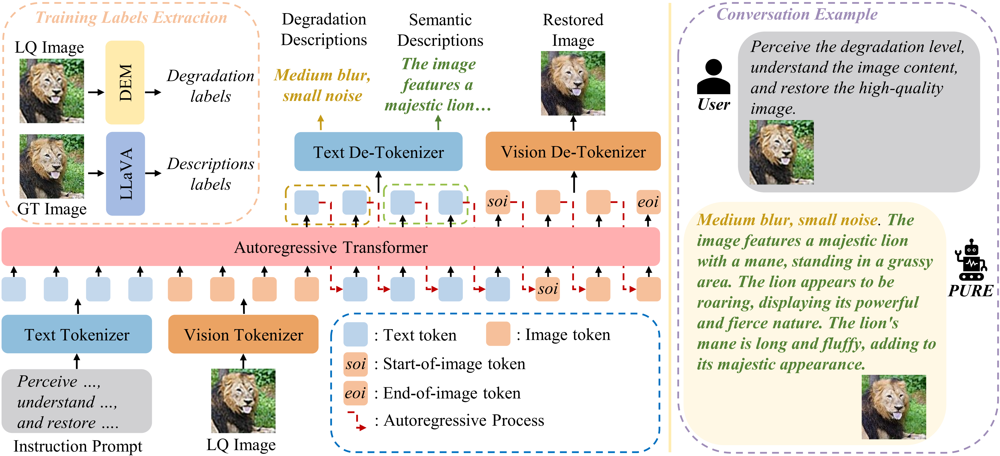
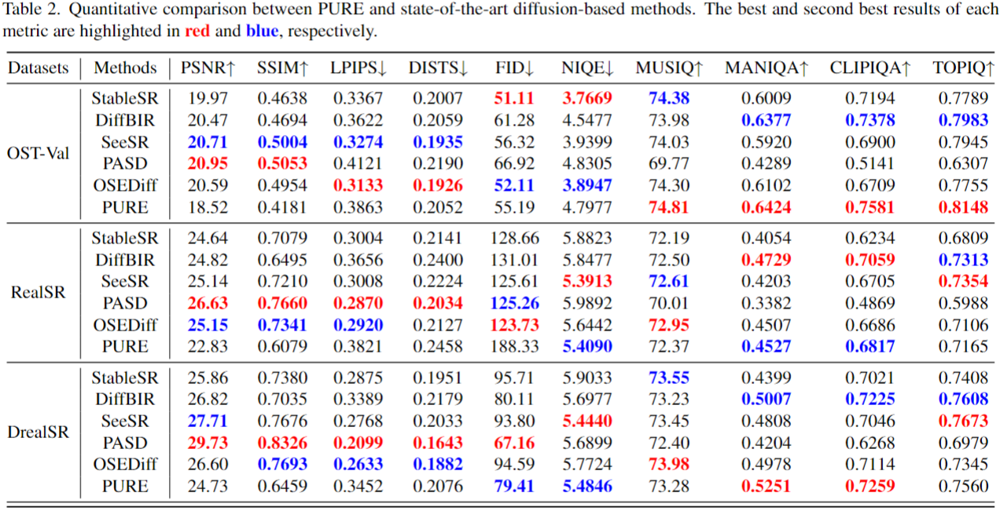
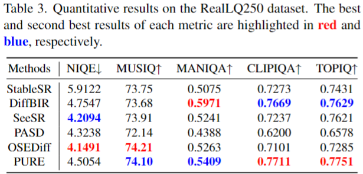
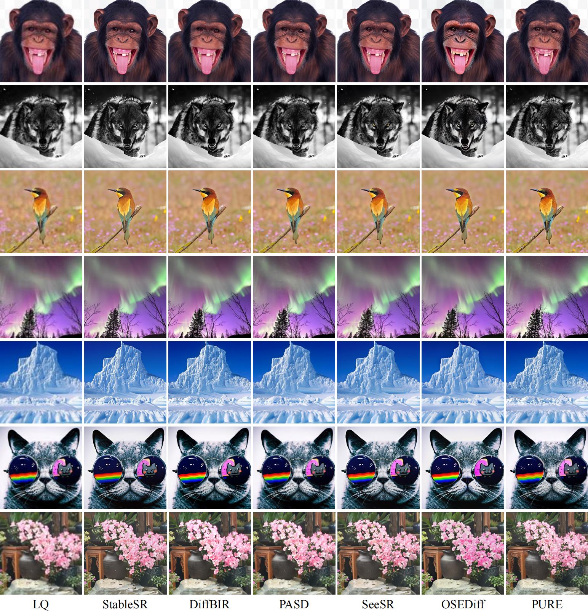

<div align="center">


<h1>Perceive, Understand and Restore: Real-World Image Super-Resolution with Autoregressive Multimodal Generative Models</h1>

<div>
    <span>Hongyang Wei<sup>1,3,*</sup></span>&emsp;
    <span>Shuaizheng Liu<sup>2,3,*</sup></span>&emsp;
    <span>Chun Yuan<sup>1,†</sup></span>&emsp;
    <span>Lei Zhang<sup>2,3,†</sup></span>
</div>
<div>
    <sup>1</sup>Tsinghua Shenzhen International Graduate School, Tsinghua University
</div>
<div>
    <sup>2</sup>The Hong Kong Polytechnic University, <sup>3</sup>OPPO Research Institute&emsp; 
</div>

[](https://arxiv.org/abs/2503.11073) [](https://huggingface.co/nonwhy/PURE)

</div>

<br>

:star: If PURE is helpful to your images or projects, please help star this repo. Thanks! :hugs:


## 📢 News
- **2025.04.11** 🎉🎉🎉 Inference code and checkpoints are released! 🎉🎉🎉
- **2025.3.13** 🎉🎉🎉 PURE is released! 🎉🎉🎉


## 🎬 Overview



## 📷 Results

<details>
<summary>Quantitative Comparisons (click to expand)</summary>

<p align="center">
  
</p>

<p align="center">
  
</p>
</details>

<details>
<summary>Visual Comparisons (click to expand)</summary>

<p align="center">
  
</p>

<p align="center">
  
</p>

<p align="center">
  
</p>
</details>

## ⚙️ Installation
```
git clone https://github.com/nonwhy/PURE.git && cd PURE
conda create -n pure python=3.10 -y
conda activate pure
pip install -r requirements.txt
pip install flash-attn --no-build-isolation
pip install -e .
```

You need to download the VQ-VAE model from [LlamaGen](https://huggingface.co/FoundationVision/LlamaGen/resolve/main/vq_ds8_c2i.pt) and place it in ```pure/tokenizer/vq_ds8_c2i.pt```.

## 💡 Inference
### 🔑 Simple Inference
The simple code for PURE inference:
```python
from inference_solver import FlexARInferenceSolver
from PIL import Image

inference_solver = FlexARInferenceSolver(
    model_path="nonwhy/PURE",
    precision="bf16",
    target_size=512,
)

q1 = "Perceive the degradation level, understand the image content, and restore the high-quality image. <|image|>"
images = [Image.open("/path/to/example_input.png")]
qas = [[q1, None]]

generated = inference_solver.generate(
                images=images,
                qas=qas,
                max_gen_len=8192,
                temperature=0.9,
                logits_processor=inference_solver.create_logits_processor(
                            cfg=0.8,
                            text_top_k=1
                        ),
            )

new_image = generated[1][0]
new_image.save("./example_output.png", "PNG")
text=generated[0]
print(text)

```
You can adjust the ```temperature``` and ```CFG(Classifier-Free Guidance)``` parameters to achieve different restoration results.

### 🚀 Accelerate Inference
We can seamlessly accelerate inference through [Speculative Jacobi Decoding](https://github.com/tyshiwo1/Accelerating-T2I-AR-with-SJD/): 

```
python test_pure_jacobi.py
```

## 📚 Training Datasets
Following [SeeSR](https://github.com/cswry/SeeSR), we train PURE on LSDIR+FFHQ10k. To generate realistic LQ-HQ image pairs for training, we apply the degradation pipeline from Real-ESRGAN.


## 🤗 Checkpoints
| Model | Size | Resolution | Huggingface |
|----------------------|--------|--------|--------------------|
| PURE | 7B | 512 | [nonwhy/PURE](https://huggingface.co/nonwhy/PURE) |

## 💕 Acknowledgements

**Thanks to the following excellent open-source projects:**
- [Chameleon: Mixed-Modal Early-Fusion Foundation Models](https://github.com/facebookresearch/chameleon)
- [Lumina-mGPT: Illuminate Flexible Photorealistic Text-to-Image Generation with Multimodal Generative Pretraining](https://github.com/Alpha-VLLM/Lumina-mGPT)
- [Accelerating Auto-regressive Text-to-Image Generation with Training-free Speculative Jacobi Decoding](https://github.com/tyshiwo1/Accelerating-T2I-AR-with-SJD/)

## 🎫 License
This project is released under the [MIT License](LICENSE).

## 📧 Contact
If you have any questions, please feel free to contact: `weihy23@mails.tsinghua.edu.cn`


## 🎓Citations
If our PURE helps your research or work, please consider citing our paper:

```
@misc{wei2025perceiveunderstandrestorerealworld,
      title={Perceive, Understand and Restore: Real-World Image Super-Resolution with Autoregressive Multimodal Generative Models}, 
      author={Hongyang Wei and Shuaizheng Liu and Chun Yuan and Lei Zhang},
      year={2025},
      eprint={2503.11073},
      archivePrefix={arXiv},
      primaryClass={cs.CV},
      url={https://arxiv.org/abs/2503.11073}, 
}
```